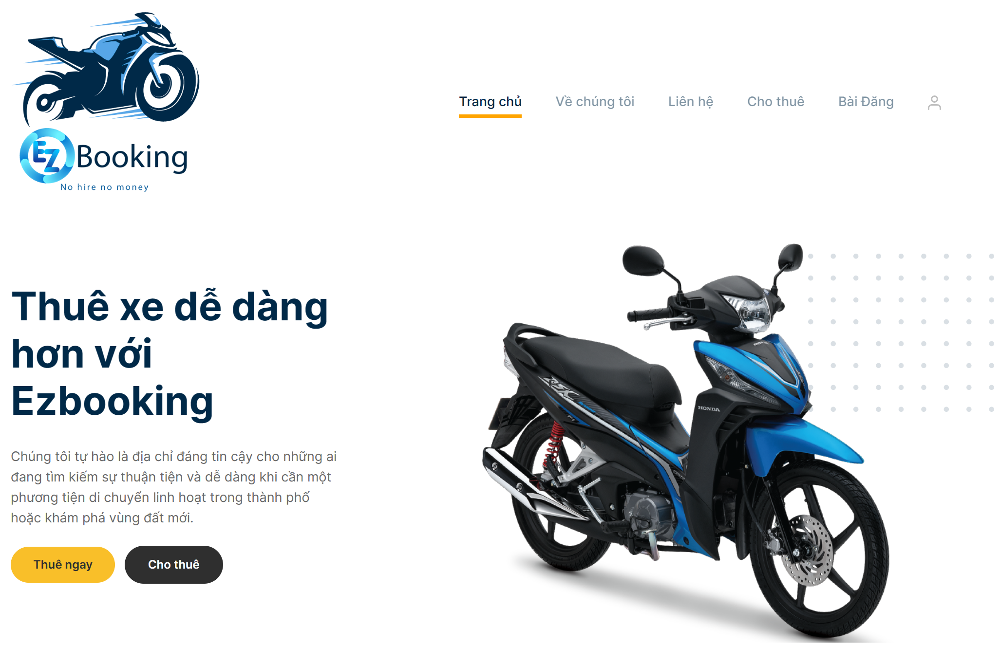
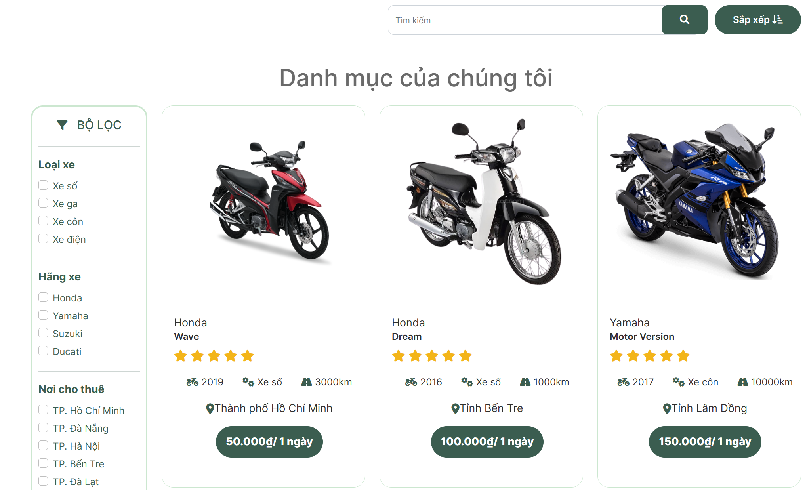
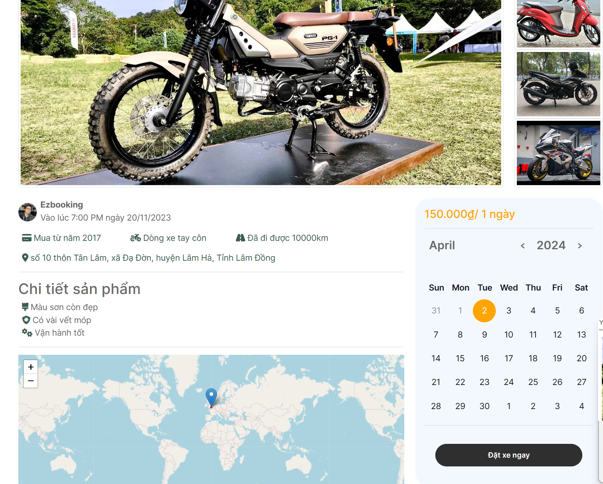
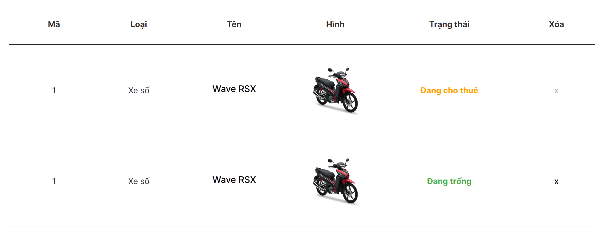

# Đồ án web cuối kỳ nhóm 2 - Ezbooking - Trang web cho thuê xe máy

## Giới thiệu

Ezbooking là một trang web cho thuê xe máy, cung cấp các dịch vụ cho thuê và đăng bài cho thuê linh hoạt. Trang web được phát triển bởi nhóm 2 lập trình ứng dụng Web - NT208.O21.ANTT.

## Các chức năng chính của trang web:

1. **Đăng nhập và đăng ký:** Người dùng có thể đăng nhập vào tài khoản hiện có hoặc đăng ký tài khoản mới.

2. **Đăng bài cho thuê:** Cho phép người dùng đăng thông tin về các xe máy họ muốn cho thuê.

3. **Thuê xe:** Người dùng có thể tìm kiếm và thuê các xe máy có sẵn trên trang web.

4. **Đánh giá và bình luận:** Người dùng có thể đánh giá và bình luận về các dịch vụ đã sử dụng.

5. **Thanh toán:** Hỗ trợ thanh toán thông qua bên thứ ba để hoàn tất quá trình thuê xe.

6. **Tìm kiếm thông tin cho thuê:** Cung cấp công cụ tìm kiếm để người dùng dễ dàng tìm kiếm thông tin về việc thuê xe.

7. **In hợp đồng:** Cho phép in hợp đồng giữa người cho thuê và người thuê để bảo đảm sự minh bạch và công bằng trong giao dịch.

## Các mô hình sử dụng

1. Frontend: HTML, CSS

2. Backend: NodeJS

3. Database: MongoDB
 
## Hình ảnh trang web:

### Giao diện chính của trang web:

### Trang trưng bày sản phẩm:

### Trang chi tiết sản phẩm:

### Trang đăng bài cho thuê:

### Trang quản lý cho thuê (dành cho chủ nhà):

## Một số lưu ý:

- Đảm bảo rằng bạn đã có tài khoản người dùng để có thể thuê xe và sử dụng các dịch vụ khác trên trang web.

- Đối với chủ thuê xe, đăng nhập vào tài khoản của mình để quản lý các bài đăng và dịch vụ cho thuê của mình.

- Hãy đảm bảo rằng bạn đã đọc và hiểu các điều khoản và điều kiện trước khi thuê xe.

Chúc bạn có trải nghiệm tuyệt vời khi sử dụng trang web Ezbooking!
